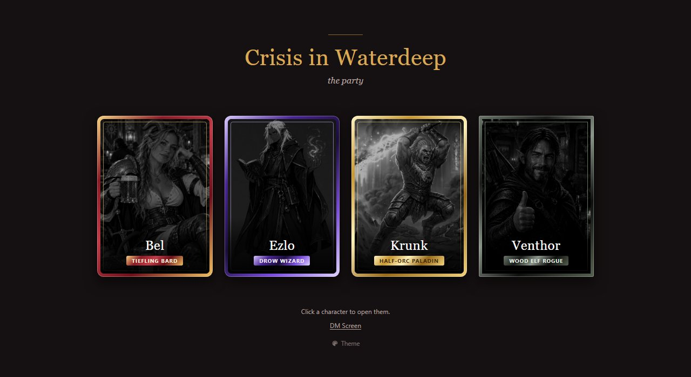
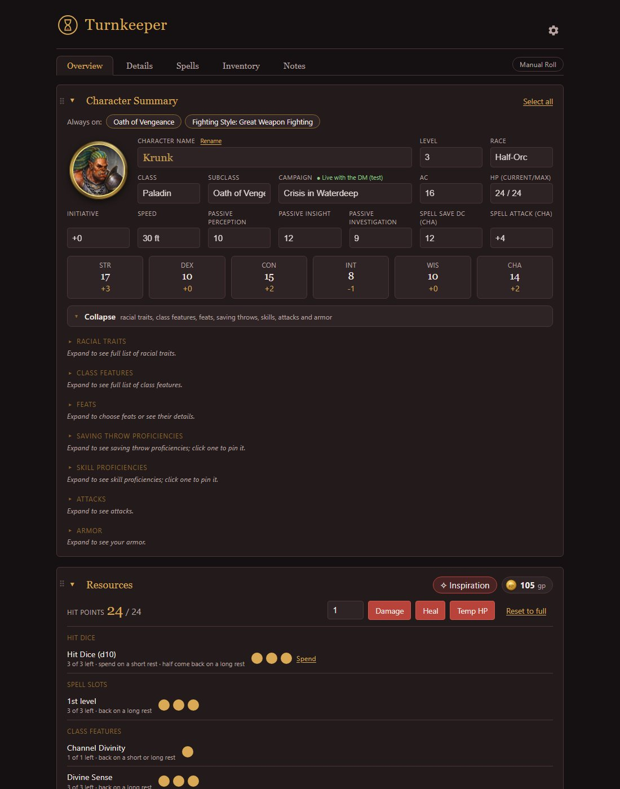
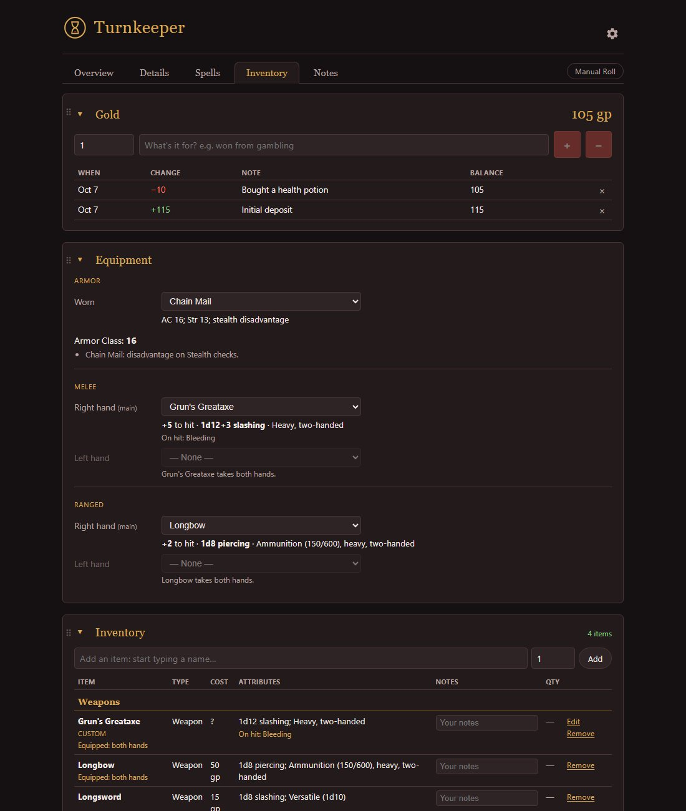
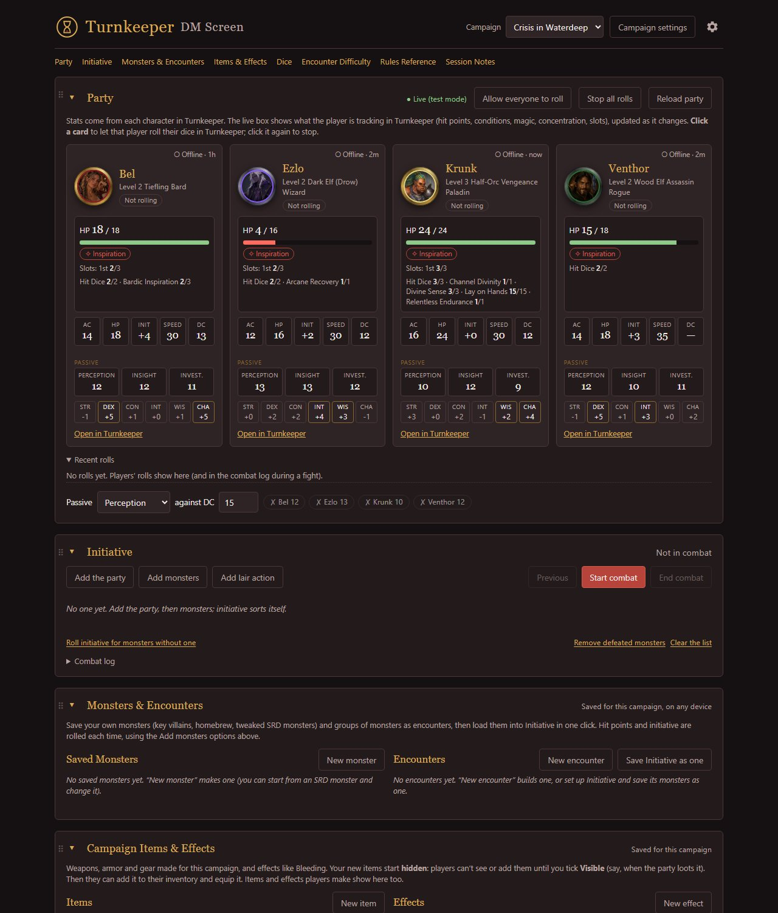

# Turnkeeper

A character tracker for Dungeons & Dragons 5e, built to help new players take their turn.

**[Open Turnkeeper](https://justinthuffman.github.io/turnkeeper/)** · [What's new](CHANGELOG.md)

Turnkeeper keeps each character, lays out what that player needs at the table, and rolls the dice.
It follows the 2014 rules, so it knows what the character can do on their turn, works out the
numbers, and rolls 3D dice that everyone in the campaign sees land the same way.

It's a set of static web pages, with nothing to install and no login yet. Characters, the
campaign's custom items and the DM's screen are saved in a free Firebase database, which also
carries players' live hit points, conditions and rolls to the DM Screen.

## What it does

- **Keeps the whole character.** Ability scores, saves, skills and level live in Turnkeeper,
  and it works out the rest: modifiers, initiative, passive scores, spell save DC. Details,
  Spells, Inventory and Notes each have their own tab; drag tabs and panels into your own order.
- **Walks you through your turn.** The Combat Menu lays out actions, bonus actions and
  reactions. Pick an attack, spell or feature and Turnkeeper rolls it, with advantage, bonuses
  and damage already worked out. A Manual Roll button covers anything else.
- **Tracks what you use.** Hit points, temporary HP, spell slots, Hit Dice, class resources,
  Inspiration, death saves and concentration. Start of my turn and End my turn keep count of
  your reaction, attacks and once-per-turn features, and count down spells with a duration.
- **Knows the rules.** Conditions and magic on you (Bless, Haste, Poisoned…) change your
  rolls. Spell limits come from the Player's Handbook tables, including the wizard's
  spellbook. Languages and tools from your race, class and background fill in on their own.
- **Gear that matters.** Equip weapons and armor in each hand from your inventory and your
  attacks and AC follow. Custom items (a homebrew greataxe that makes its target bleed) and
  custom effects are shared with the whole campaign.
- **Gold with a ledger.** Every change has a note, so you can see where the money went.
- **Follows you.** Everything is saved to the character, so it's the same on your phone and
  your laptop, and a change on one shows on the other.
- **Works on phones** as well as computers.

## Using it

- **The party:** the [hub](https://justinthuffman.github.io/turnkeeper/) has a card for each
  character in our Crisis in Waterdeep campaign. Click one to open their tracker.
- **The DM:** the [DM Screen](https://justinthuffman.github.io/turnkeeper/dm.html), linked under
  the hub's cards, shows the party live, runs initiative with SRD monster stat blocks, saves
  monsters and encounters, rates encounter difficulty, and keeps a rules reference and session
  notes. The DM decides who may roll, and prepares items that stay hidden until the party finds
  them.

## Files

| File | What it is |
| --- | --- |
| `index.html` | The campaign hub |
| `turnkeeper.html` | The tracker |
| `dm.html` | The DM Screen |
| `js/` | Shared code: settings and the database connection, dice, themes, tabs and panels, the character's panels, inventory, items and effects |
| `js/data/` | The rules data: spells, races, classes, feats, equipment and backgrounds (2014 Player's Handbook) |
| `css/`, `themes.css` | Styles and the color themes |
| `portraits/`, `icons/`, `trays/` | Character art, the site's icons and the dice trays |
| `CHANGELOG.md` | Every change, newest first |
| `docs/` | Screenshots for this README |
